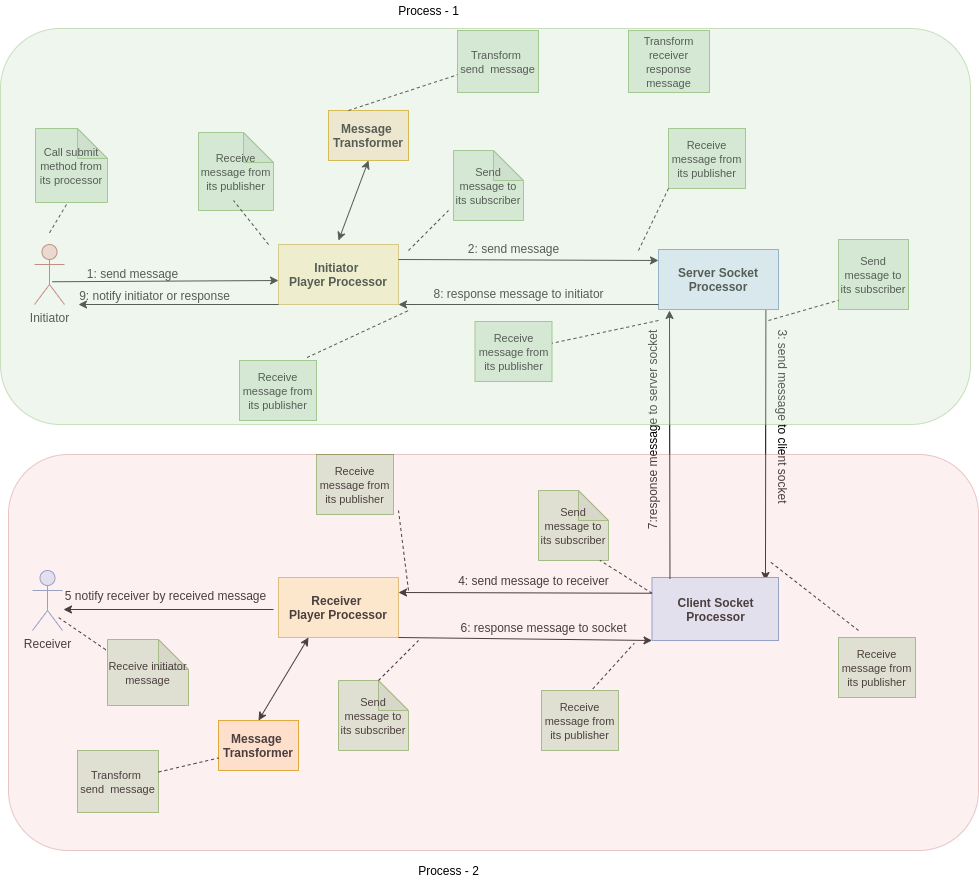

## Concurrent Players Messaging

##### This is a messaging app that has two players. Let me call the first player Initiator and the second on Receiver.

The basis of our program is to send and to receive a message between these two players.

The process of the program is such that the initiator sends her first message to the receiver and waits for the receiver to send her reply message.

The receiver of the message should, after receiving the sent message, create her message in the following format and send it to the initiator.

> received message + number of current sent messages by receiver

Example of first sending message:
```
Initator sent message is: Hi 360T
Receiver received message is: Hi 360T
Receiver response message is: Hi 360T1
Initiator received message is: Hi 360T1
```

And the format of the next messages will be as follows:
```
Initator sent message is: Hi 360T11
Receiver received message is: Hi 360T11
Receiver response message is: Hi 360T112
Initiator received message is: Hi 360T112
```

And this format will continue to send the message to the number requested at the beginning of the program.

##### This program is created in two packages called:
 - simple 
 - structured

##### Simple model:
In the simple package, the Player class plays the main role.

Player class has a PlayerRole field that indicates the current player instance is an Initiator or a Receiver.

Player class also has two methods of sending and receiving messages.

The message formatting rule is also handled in these two methods.

With the help of Java concurrency package objects, I have tried to prevent synchronization errors.


##### The program will run in two models:
 - single process 
 - double processes


###### Single Process 
In the single process model, two instances of the Player class are created and each Player instance is executed by a separate thread.


###### Double Processes
In the two processes model, two Player instances are created and executed in two separate processes.

The following diagram shows the design of the program using named pipe programming.


##### Structured model:
In the structured model, there are different objects that are as follows:
- MessageModel
- PlayerModel
- ProcessorModel
- SubscriptionModel
- MessageOperationDelegation
- MessageTransformer of Function type

In this package, an attempt has been made to minimize the dependence between classes 
and whenever there is a need to create composite objects, this issue is solved with the composition.

###### The design patterns used in this package are:
- combination of both Iterator and Observer patterns based on java 9 Flow api
- Template method
- Delegation

The routine of the program is such that with the start of the application, two Initiator and Receiver Player instances are created.
In the following, two instances of the processor player class will be made. 

Each of these two is responsible for handling the sending and receiving of messages from each Player instances.
Now to run the program in the same java process with the these created components is possible.


###### Here we need to look at running Java applications in more than one process.
Some of the IPC methods in Java are:
- File
- Message Queue
- Memory Mapped files sharing
- Named pipe by the help of System.in and System.out
- Socket


In this program, two models of Named pipe and Socket programming are used.

In a simple package, the program is executed as a single process with the help of named pipe method.

In the structured package, both single process and double process are performed by socket programming method.

The following diagram shows the design of the program using socket programming.


According to the diagram the above components defined with the help of iterator and observer pattern according to java 9 Flow Api.

This means that the initiatorProcessor, and the serverSocketPublisher both subscribe to each other.

On the other hand, the two instances of serverSocket and clientSocket also communicate with each other through socket.

In this way, each of the two combinations of processor and socket processor can be executed in a separate java process.
